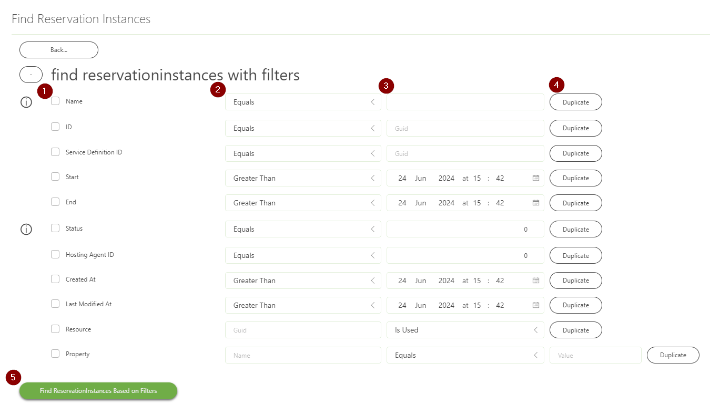
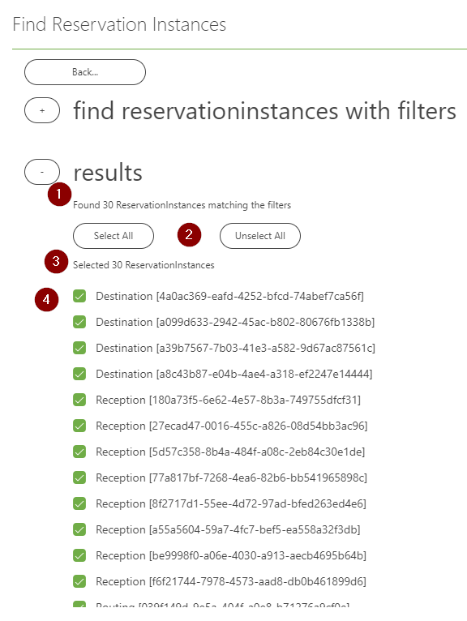

# Skyline.DataMiner.Utils.ExposerWidgets

This solution contains all widgets and sections representing filters that can be used to find all kinds of objects in the DataMiner system, e.g.: DOM instances, reservations instances, tickets, jobs, ...
The solution is released as a public Nuget so every automation script can implement these widgets and sections.

## User Guide

### Configuring Filters

See the screenshot below for more details.

1. **Including/excluding filters** can be done by checking or unchecking the checkbox next to the item property name.

1. **Filter type** can be selected using the dropdowns marked with number 2. Different properties allow different filter types depending on their possible values.

1. **Filter value** can be filled in in the boxes marked with number 3. Depending on the property that is being filtered on, this will we strings, integers, Guids or datetimes.

1. **Adding more filters** can be done using the duplicate button, marked with number 4. There is no limit on the amount of filters you can include.

1. **Executing the query** with the included filters can be done using the button at the bottom. Marked in the screenshot below with number 5.

> [!IMPORTANT]  
> All included filters will be combined with an AND operation. There is currently no way of adding OR filters.

### Finetuning results

Once the items are retrieved based on the filters, there is the possibility to finetune the selection manually. As can be seen in the screenshot below.

1. The **amount of matching items** is displayed to give a quick view on how many total items are in the system that match the filters.

1. **Selecting/unselecting all items** can be done using the buttons marked with number 2.

1. The **amount of selected items** is also displayed to keep the user aware of his current selection.

1. A scrollable checkbox list allows users to **individually select/unselect** items to finetune the result to their wishes.

